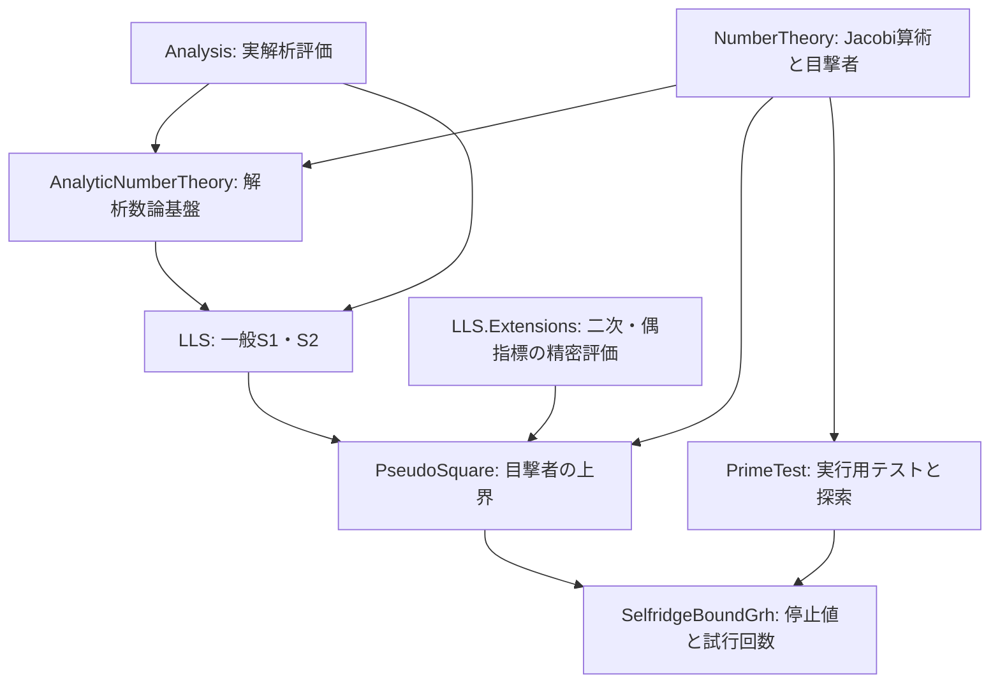

# 公開モジュールの構成と成果

この文書群は、現在のLeanソースで公開されている主な定義・定理と、その接続を説明する。
数式の `log` は自然対数。自然数の量を実数の上界と比較するときは、Leanでは実数への型変換を伴う。

## 7つの入口

| 公開入口 | 主な主張・成果 | 前提の位置付け |
|---|---|---|
| [Analysis](Analysis.md) | 対数・定数・誤差項の実解析的評価 | RH・GRH不要 |
| [AnalyticNumberTheory](AnalyticNumberTheory.md) | 重み付き素数和、導手補正、ζ・L関数の零点と輪郭積分 | 無条件の基盤とRH・GRHを明示した評価 |
| [LLS](LLS.md) | 一般指標版・真部分群版S1、真部分群版S2と最小素数評価 | 最終解析定理はGRHを仮定 |
| [NumberTheory](NumberTheory.md) | Jacobi指標、原始化、奇素数目撃者の無条件存在 | RH・GRH不要 |
| [PrimeTest](PrimeTest.md) | 実行可能なBPSW等のテスト、素数を受理する証明 | トップレベルの素数完全性は無条件 |
| [PseudoSquare](PseudoSquare.md) | Jacobi目撃者の点ごと・有限最大の明示上界 | 有限証明は無条件、解析的上界はGRH下 |
| [SelfridgeBoundGrh](SelfridgeBoundGrh.md) | Selfridge停止値・最大値・Jacobi試行回数の上界 | 解析的上界はGRH下 |

## 成果の接続

次の図は主な数学的な接続を示す。全import辺を列挙した図ではない。



一般の解析・解析数論・数論の各層は、LLSやPseudoSquareをimportしない。
LLS本体もExtensionsをimportしない。`PseudoSquare` の `=-1` 上界は一般S1の結論から導き、
`≠1` 上界は共通の中間評価に二次・偶指標の精密評価と有限証明を組み合わせる。
PrimeTestの有限探索証明にはPseudoSquareの有限証明書を利用する箇所がある。

## 読み方と利用方法

最終的な数学的上界は [PseudoSquare](PseudoSquare.md) と
[SelfridgeBoundGrh](SelfridgeBoundGrh.md)、その解析的な根拠は [LLS](LLS.md) を参照する。
実行用の素数性テストを利用する場合は [PrimeTest](PrimeTest.md) から読む。
[C++・Pythonの参考実装](BPSWImplementations.md)には実行方法とLean版との相違をまとめている。

```lean
import PseudoPrime
```

これにより7入口と `PseudoPrime.LLS.Extensions` が読み込まれる。
必要な領域だけなら、例えば `import PseudoPrime.LLS` のように選択できる。
各ページ末尾の `#check` は公開APIを確認する例である。

GRHは明示的に受け取る仮定であり、プロジェクトがGRHを証明したという意味ではない。
また、BPSWの「素数なら受理する」と「受理したなら素数」は異なる主張である。
有限証明書、数学的な最小元、実行可能な探索の違いは各ページで説明する。

Leanプロジェクトの `lakefile.toml` があるディレクトリで `lake build` により全体を検証できる。
