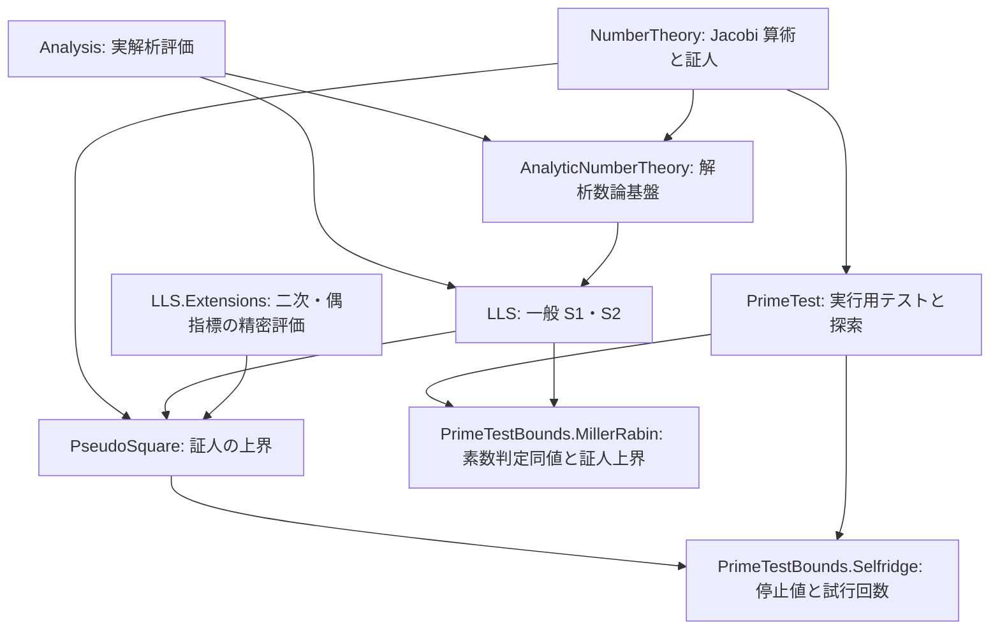

# 公開モジュールの構成と成果

この文書群では、現在の Lean ソースが公開する主な定義・定理と、それらの関係を説明する。数式の $\ln$ は自然対数を表し、Lean の `Real.log` に対応する。自然数を実数の上界と比較する箇所では、Lean 上で実数への型変換を行う。

## 8 つの公開領域

| 公開入口 | 主な主張・成果 | 前提の位置付け |
|---|---|---|
| [Analysis](Analysis.md) | 対数・定数・誤差項の実解析的評価 | RH・GRH 不要 |
| [AnalyticNumberTheory](AnalyticNumberTheory.md) | 重み付き素数和、導手補正、ζ・ L 関数の零点と輪郭積分 | 無条件の基盤と RH・GRH を明示した評価 |
| [LLS](LLS.md) | 一般指標版・真部分群版 S1、真部分群版 S2 と最小素数評価 | 最終解析定理は GRH を仮定 |
| [NumberTheory](NumberTheory.md) | Jacobi 指標、原始化、奇素数証人の無条件存在 | RH・GRH 不要 |
| [PrimeTest](PrimeTest.md) | 実行可能な BPSW 等のテスト、素数を受理する証明 | トップレベルの素数完全性は無条件 |
| [PseudoSquare](PseudoSquare.md) | Jacobi 証人の点ごと・有限最大の明示上界 | 有限証明は無条件、解析的上界は GRH 下 |
| [PrimeTestBounds.Selfridge](SelfridgeBoundGrh.md) | Selfridge 停止値・最大値・Jacobi 試行回数の上界 | 解析的上界は GRH 下 |
| [PrimeTestBounds.MillerRabin.FromLLS](MillerRabinBoundGrh.md) | GRH 下での「奇数 $n > 1$ の素数性 $\iff$ 上界内の全素数底が合格」と、合成数に対する棄却証人上界 | 全範囲の上界は GRH 下、真部分群と有限区間は無条件 |

## 成果の接続

次の図は、主な数学的関係を示す。すべての import 関係を列挙したものではない。


```mermaid
flowchart TD
  A[Analysis: 実解析評価] --> ANT[AnalyticNumberTheory: 解析数論基盤]
  A --> LLS[LLS: 一般 S1・S2]
  NT[NumberTheory: Jacobi 算術と証人] --> ANT
  ANT --> LLS
  NT --> PS[PseudoSquare: 証人の上界]
  LLS --> PS
  EXT[LLS.Extensions: 二次・偶指標の精密評価] --> PS
  NT --> PT[PrimeTest: 実行用テストと探索]
  PS --> SB[PrimeTestBounds.Selfridge: 停止値と試行回数]
  PT --> SB
  PT --> MR[PrimeTestBounds.MillerRabin: 素数判定同値と証人上界]
  LLS --> MR
```

一般の解析・解析数論・数論の各層は、LLS や PseudoSquare を import しない。 LLS 本体も Extensions を import しない。 `PseudoSquare` の Jacobi 記号が $-1$ となる証人の上界は一般 S1 の結論から導き、 Jacobi 記号が $1$ でない証人の上界は共通の中間評価に二次・偶指標の精密評価と有限証明を組み合わせる。 PrimeTest の有限探索証明には PseudoSquare の有限証明書を利用する箇所がある。

## 読み方と利用方法

最終的な数学的上界については [PseudoSquare](PseudoSquare.md)、[PrimeTestBounds.Selfridge](SelfridgeBoundGrh.md)、[PrimeTestBounds.MillerRabin](MillerRabinBoundGrh.md) を参照する。その解析的な根拠は [LLS](LLS.md) で説明する。BPSWの定義・理論・判定手順は [BPSWと強化版の実装手順](BPSWAlgorithm.md) だけで読める。Leanの公開APIは [PrimeTest](PrimeTest.md)、C++・Pythonの実行方法とLean版との違いは [参考実装](BPSWImplementations.md) にまとめている。

```lean
import PseudoPrime
```

これにより、表に示した8領域と `PseudoPrime.LLS.Extensions` を読み込む。必要な領域だけを使う場合は、たとえば `import PseudoPrime.LLS` のように個別に選べる。Miller–Rabin の素数判定同値と証人上界には、`import PseudoPrime.PrimeTestBounds.MillerRabin.FromLLS` を使う。各ページ末尾の `#check` は、公開 API を確認する例である。

GRH は明示的に受け取る仮定であり、プロジェクトが GRH を証明したという意味ではない。また、BPSW の「素数なら受理する」と「受理したなら素数」は異なる主張である。有限証明書、数学的な最小元、実行可能な探索の違いは各ページで説明する。

Lean プロジェクトの `lakefile.toml` があるディレクトリで `lake build` により全体を検証できる。
